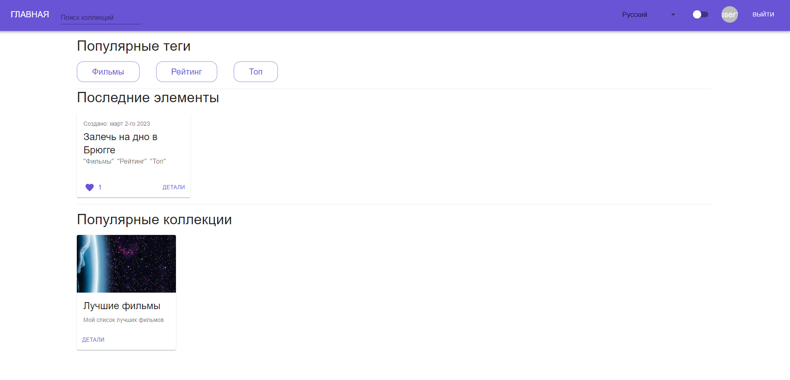
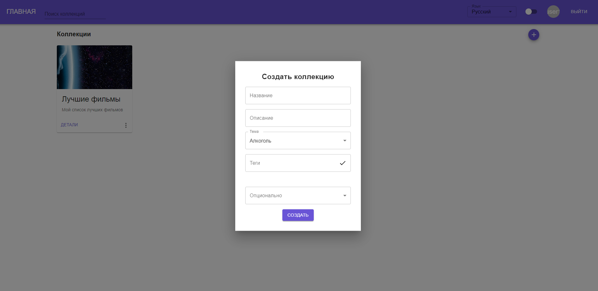
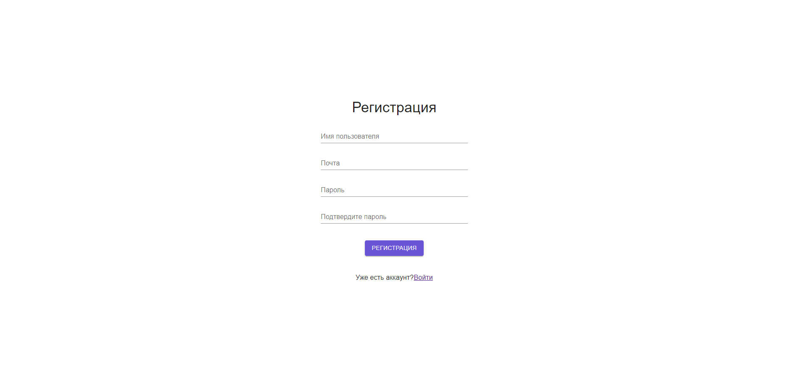

# Collections App

App for user collections [Deploy](https://fanciful-florentine-8b6b86.netlify.app).

## How to start app

To run the application use this command:

### `npm start`

## Home page

## Create your collection

## Register and manage your collections

